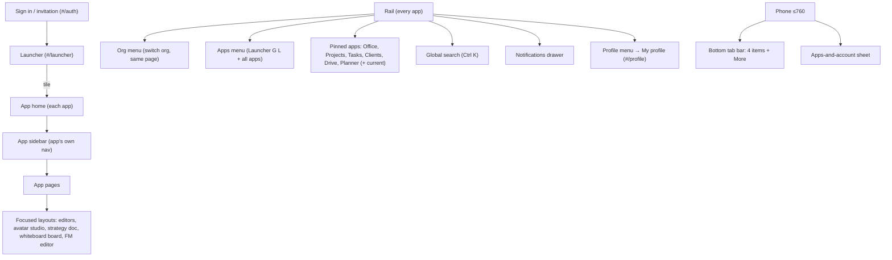

# Global navigation map

```mermaid
flowchart TB
  signin["Sign in / invitation (#/auth)"] --> launcher["Launcher (#/launcher)"]
  launcher -->|tile| apphome["App home (each app)"]
  rail["Rail (every app)"] --> orgmenu["Org menu (switch org, same page)"]
  rail --> appsmenu["Apps menu (Launcher G L + all apps)"]
  rail --> pinned["Pinned apps: Office, Projects, Tasks, Clients, Drive, Planner (+ current)"]
  rail --> search["Global search (Ctrl K)"]
  rail --> bell["Notifications drawer"]
  rail --> profmenu["Profile menu → My profile (#/profile)"]
  apphome --> sidebar["App sidebar (app's own nav)"]
  sidebar --> pages["App pages"]
  pages --> focused["Focused layouts: editors, avatar studio, strategy doc, whiteboard board, FM editor"]
  phone["Phone ≤760"] --> bbar["Bottom tab bar: 4 items + More"]
  phone --> sheet["Apps-and-account sheet"]
```

Each app's sidebar items with exact labels and destinations: `01_APPLICATIONS/<app>/APP_OVERVIEW.md`.
